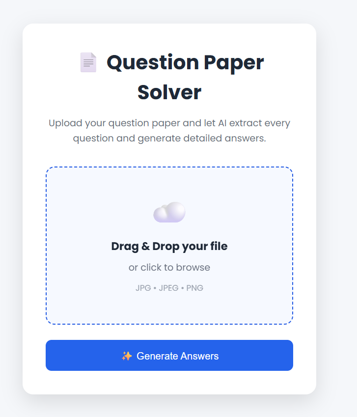
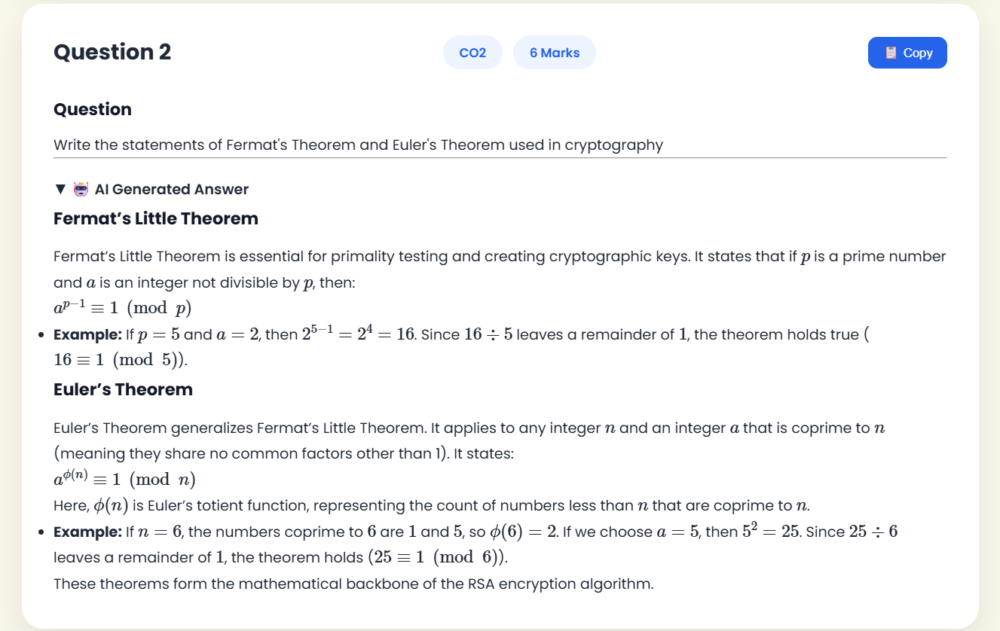
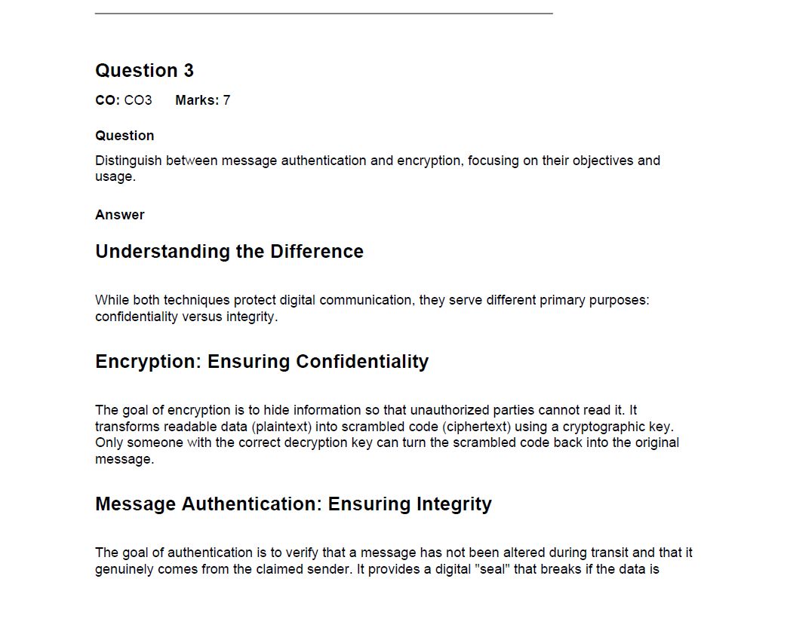

# 📄 AI Question Paper Solver

An AI-powered web application that extracts questions from an uploaded question paper using OCR, generates detailed answers using Google's Gemini AI, and allows users to download the solved paper as a professionally formatted PDF.


---

## ✨ Features

- 📤 Upload question paper images
- 🔍 Extract questions using PaddleOCR
- 🤖 Generate AI answers with Google Gemini
- 📋 Copy answers with one click
- 📄 Download solved paper as PDF
- 🧮 Render mathematical expressions on the webpage
- 📱 Responsive user interface

---

## 🛠 Tech Stack

### Backend
- Python
- Flask

### AI
- Google Gemini API

### OCR
- PaddleOCR

### Frontend
- HTML
- CSS
- JavaScript

### PDF Generation
- ReportLab

---

## 🚀 Installation

Clone the repository

```bash
git clone https://github.com/yourusername/AI-Question-Paper-Solver.git
```

Install dependencies

```bash
pip install -r requirements.txt
```

Run the application

```bash
python app.py
```

---

## 📸 Screenshots

### Home Page



### Results Page



### Generated PDF



---

## 🔄 Workflow

```text
Upload Image
      │
      ▼
PaddleOCR
      │
      ▼
Question Extraction
      │
      ▼
Google Gemini AI
      │
      ▼
Generate Answers
      │
      ├──► Web
      └──► PDF
```

---

## 👨‍💻 Author

**Divyansh Singh**

B.Tech CSE (AI & ML)